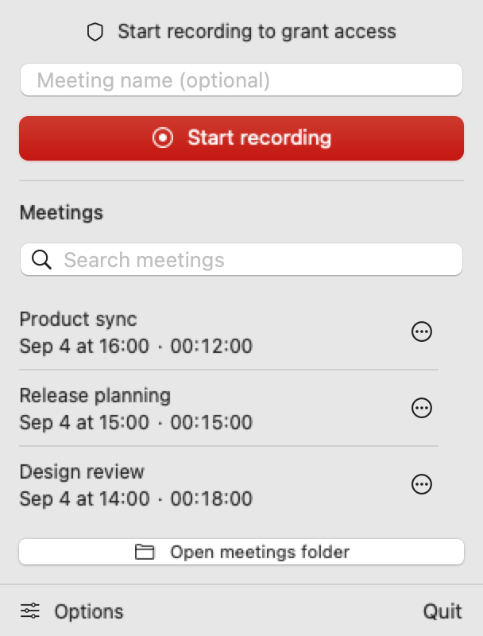

# Better Meeting

Record a display, system audio, and microphone from the macOS menu bar. After
recording stops, Whisper transcribes the audio locally. Each meeting gets a
folder with the video, audio, and transcript; clicking the finished meeting in
the menu opens its files in Finder.

Requires Apple Silicon and macOS 15+. Downloads approximately 1.6 GB of speech
model files during initial setup. Transcription runs locally and works offline
afterward.



The app's menu, shown with fictional meetings.

## Install with Homebrew

```bash
brew tap --custom-remote kremnyi/better-meeting https://github.com/kremnyi/better-meeting-menubar
brew install --cask kremnyi/better-meeting/better-meeting
open -a "Better Meeting"
```

The tap keeps the name `kremnyi/better-meeting`. If you installed before the
repository was renamed, run the tap command above to update its URL.

The cask downloads the app from [GitHub Releases](https://github.com/kremnyi/better-meeting-menubar/releases)
and verifies its SHA-256 checksum. You can also download the ZIP there, extract
it, and move the app to `/Applications`. Xcode is not required.

Releases use a self-signed certificate, without an Apple Developer ID or notarization. If
macOS blocks the first launch, try opening the app, then use **System Settings
→ Privacy & Security → Open Anyway**. See [Apple's instructions](https://support.apple.com/102445).
Managed Macs may not allow this exception.

## Update the app

Open **Options** to see the installed version, release notes, and **Check for Updates**
below the automatic-download setting. Update progress and errors stay in Options,
without separate update dialogs. Sparkle verifies updates with a separate
signing key before extraction.

Enable **Options → Download updates automatically** to check GitHub on each launch
and periodically while the app is open, preparing updates in the background.
This is off by default. A blue dot beside **Options** means an update is ready.
Open **Options → Restart to Update** to install and reopen the app. A prepared update can also install
when you quit. Recording or processing must finish before restarting. If macOS
requires authorization, click **Install Update** to continue. Failed updates show
an inline retry action.

To update with Homebrew, finish any active recording, quit the app, and run:

```bash
brew update
brew upgrade --cask kremnyi/better-meeting/better-meeting
```

Releases reuse the same signing certificate so macOS can recognize the app across
updates. Uninstalling the app keeps saved meetings.

## Record a meeting

1. Open the app.
2. Enter a meeting name or leave it empty for automatic naming.
3. Open **Options** in the bottom-left corner to choose a display, microphone, and save folder.
   The app remembers these choices. Defaults are the main display, system
   microphone, and `~/Documents/Better Meetings`.
4. Start recording and grant **Screen & System Audio Recording** and
   **Microphone** access. If access is blocked, click **Open System Settings** to enable it,
   then use **Restart Better Meeting** for screen access or **Try again** for microphone access.
5. Stop recording and wait for transcription. Click the finished meeting to
   open its files in Finder.

The app downloads and prepares the selected speech model in the background when
needed. The menu shows progress; you can record during setup, but transcription
waits until the model is ready. If setup fails, use **Retry setup**.
If Core ML cannot load the model files, the app clears that model's cache so retrying
downloads a fresh copy. Other downloaded models and saved meetings are kept.

While recording, separate microphone and system-audio meters show incoming sound.
An empty meter can mean silence; check the selected input if it stays empty while
you expect sound.

If neither source has detected audio after 30 seconds, an amber warning replaces
the recording status. With the menu closed, the app also sends one notification;
click it to open the recording controls. Recording continues. The warning clears
when either source detects audio, and later pauses do not trigger another warning.

The menu-bar icon spins during processing, or stays still with Reduce Motion enabled.
A warning icon appears if recording or transcription fails and stays until you retry
or dismiss the error. Search, Finder, and **Copy Transcript** remain available during
transcription and export; renaming and starting another job wait until processing finishes.

Before your first recording or retry, the app asks permission to send notifications
for missing audio and transcription results. Click an audio warning to open the
recording controls, or a transcription notification to open the meeting's folder.
You can change notification access in macOS **System Settings → Notifications
→ Better Meeting**.

To open the app automatically when you sign in, enable **Options → Launch at login**.
If macOS requires approval, use **Open Login Items…** below the checkbox and allow
Better Meeting to open at login.

## Calendar integration

The menu can show your next meeting from the macOS Calendar app. Enable
**Options → Calendars** and choose which calendars to read. The menu shows the
next event within 24 hours with a **Record this meeting** button that starts a
recording named after the event. With **Notify at start** enabled, the app also
sends a notification when the event starts.

The integration is off by default, reads events only, and never edits them.
macOS requires full calendar access for reading; the app offers to request it
when you first enable the feature. Event details stay on your Mac. Links
between recordings and calendar events are stored in the meeting folder; see
[docs/calendar-data.md](docs/calendar-data.md) for the data model.

## Recording settings

Options groups settings under **Recording**, **Transcription**, and **Files**.
These settings remain available after an error and are locked during recording or
processing. Launch-at-login and automatic-download preferences remain available.
**Resolution** and **Frame rate** are shown directly under Recording and default
to 1440 px and 10 fps. Resolution
limits the video's longest edge to 1280, 1440, 1920, or 2560 pixels. It uses
Retina pixels, preserves the display's proportions,
and never upscales smaller displays. Frame rate sets a maximum of 5, 10, or
30 fps. Higher settings can increase file size and processing load; macOS manages
compression bitrate. These settings do not affect audio or transcription.

## Transcription settings

### Languages

Choose the expected **Languages** in one menu. Ukrainian, Russian, and English
are selected by default. Choose one for a single pass or several for multilingual
meetings; at least one is required. The app remembers your selection.

Each selected language adds one pass over the whole recording. The app merges
segments by confidence and filters likely silence hallucinations. Fewer languages
finish faster. Progress shows the current language and pass. All languages listed
by WhisperKit are available.

### Model

**Advanced… → Model** offers multilingual Small, Large v3 Turbo (default), and Large v3.
Small uses less memory; Large v3 takes longer and uses more memory. Changing
models releases the previous model before loading the next one. The picker waits
for active setup to finish.

### Vocabulary

Use **Advanced… → Vocabulary** for names, companies, and technical terms separated
by commas. These optional hints use Whisper's existing prompt support and stay on
your Mac. The app remembers them; changing hints reruns the affected language passes.

### Decoding

**Advanced…** opens model, vocabulary, and decoding settings in the
same panel. Use the back button to return to Options. Decoding includes temperature,
fallback attempts and temperature increase, no-speech and log-probability thresholds,
and the repetition threshold.

**Reset decoding defaults** resets decoding without changing the selected model,
vocabulary, or speaker-label option. Model and decoding settings are saved with
each transcript; retries reuse them and changed settings invalidate cached passes.

### Speaker labels

**Speakers → Add labels** in **Options → Transcription** is off by default. When enabled,
SpeakerKit identifies voices locally after transcription and adds **Speaker 1**,
**Speaker 2**, and so on to the transcript and exported timeline. The first use
downloads about 11 MB of models; later runs use the saved models offline.
This adds processing time. Labels describe voices within this meeting, not real
names or identities across meetings. Each transcript segment gets the speaker
with the most overlapping speech; ties and unmatched segments stay unlabeled.
Fast turn-taking within a segment and overlapping voices can be mislabeled.

The setting is saved with each meeting and is also available in **Re-transcribe…**.
Changing it reuses matching transcription passes. Speaker turns are cached in
`speaker_turns.json`; changing the audio or a damaged cache reruns detection.
If speaker detection fails, the transcript is saved without labels and the menu
shows the error. Cancellation keeps completed passes for a later retry.

## Saved meetings

The menu lists all completed meetings, most recent first; scroll to see older
ones. Search finds matching titles
and saved transcript text across all completed meetings in the selected folder,
including older meetings and manual Markdown edits. Search runs locally.

Use the **•••** button on a meeting row, or right-click the row, to open
**Copy Transcript**, **Rename…**, **Re-transcribe…**, and **Export bundle…**.
Copy uses the saved Markdown, including any edits. Rename updates the folder,
title, and metadata while keeping the transcript body and media files.

### Re-transcribe a meeting

**Re-transcribe…** lets you choose languages and vocabulary for a saved meeting.
It reuses matching passes and keeps the current transcript available until the
replacement is ready. A successful run replaces the transcript, including manual
edits, while preserving the meeting name. Cancellation or failure keeps the old files.

### Transcribe all unfinished recordings

When recordings failed, were cancelled, or are waiting for transcription, the
menu shows **Transcribe all** with their count. Choosing it transcribes them in
order; progress shows **Transcribing 2 of 3** plus the current meeting and the
number still waiting. Cancel stops the queue and reports how many finished;
every recording keeps its completed language passes. If you quit while the
queue runs, the app asks whether to wait until it finishes.

### Retry or cancel transcription

If transcription fails, use **Retry transcription** or **Finish saved recording**
to resume from saved audio or video, including after a restart. When quitting during work, choose
**Finish and quit** or **Wait and quit** to let saving finish. Force Quit or power
loss can leave an unfinished video that cannot be recovered.

**Cancel transcription** stops processing and keeps the recording and completed
language passes. Use **Finish saved recording** to resume later, even after a restart.

Each completed language pass is saved as `pass_uk.json`, `pass_ru.json`, or
`pass_en.json` in the meeting folder. Retry reuses matching passes and reruns any
missing or damaged ones. Changing the audio, model, or decoding options invalidates
the affected cache. Finished transcripts are not regenerated automatically.

## Meeting files and titles

```text
2026-09-04 14.30.00 — Product sync/
├── recording.mp4
├── audio.m4a
├── transcript.md
├── transcript.json
├── pass_uk.json
├── pass_ru.json
├── pass_en.json
└── metadata.json
```

`transcript.md` has timestamps and a link to the video. `transcript.json` stores
segment times, text, language tags, and optional speaker IDs. `metadata.json` stores the title,
recording date, duration, file names, and transcription status.
`pass_<language>.json` files are per-language transcription caches reused when the same
recording is transcribed again; they are safe to delete. `previous-*` files are backup
copies kept when a meeting is renamed or re-transcribed, so the earlier transcript can
be restored if something goes wrong.

For unnamed meetings, Apple's `NaturalLanguage` framework looks for a person,
company, or product and a repeated topic. A discussion with Anna about a pricing
review might become `Anna — Pricing Review`. The folder, Markdown heading, and
metadata use the same title. Existing folders are never overwritten.
Long folder names are shortened to fit filesystem limits; the title inside the meeting stays intact.

Naming needs no additional model or API. Product names use a heuristic based on
repeated capitalized nouns; recognition varies with the transcript and language
support on the Mac. If no usable name and topic are found, the date-based name
remains. Typed titles and titles from older folders are preserved.

## Screenshots and export bundles

Choose **Export bundle…** from a finished meeting's **•••** menu or right-click.
The app reads the
saved video, extracts screenshots and screen text, and opens `artifacts/` in Finder.
Enable **Options → Files → Include screenshots and screen text** to run this
after each transcript is saved. Automatic export is off by default.

Screen extraction samples every two seconds, keeps screen changes and a frame
at least every 90 seconds, and recognizes text with Apple's Vision framework.
Repeated lines are removed. It exports up to 30 screenshots spread across the
recording, preferring frames with more new text. If no text is recognized, it
still selects screenshots. OCR uses supported languages from the transcript;
small text, rapid changes, and unsupported languages can be missed.

```text
artifacts/
├── transcript.md
├── transcript.json
├── timeline.md
├── screen.json
├── screens/
├── screens_index.md
├── languages.json
├── PROMPT.md
└── HOW-TO.md
```

The timeline combines speech, newly recognized screen text, screenshot links,
and gaps of at least eight seconds between speech segments. `HOW-TO.md` reports
language shares based on transcribed speech duration; `languages.json` stores
the same durations and shares. Percentages exclude gaps and describe language
labels, not recognition accuracy.

The exported Markdown includes manual transcript edits. The timeline and language
shares use the timed JSON segments, which manual Markdown edits do not change.
Audio and video stay in the meeting folder. `PROMPT.md` is a short instruction
for using the bundle with an external assistant; the app does not send it anywhere.

Export runs locally with progress and cancellation. Regenerating replaces the
previous bundle only when the new one is ready. Failure or cancellation preserves
the transcript and any previous bundle. Automatic export failures appear in the
menu without marking the saved transcript as failed.

## Privacy and model storage

Recording, transcription, screenshots, OCR, and automatic naming run on your Mac.
The app does not upload meetings. Update checks contact GitHub. Speech models
download from Hugging Face once per selected model and work offline after setup.
Removing or damaging those files can require another download.

Model files live under `~/Documents/huggingface/models/argmaxinc/whisperkit-coreml/`.
Tokenizer files may also be stored under
`~/Documents/huggingface/models/openai/` for each selected model. WhisperKit calls the
turbo model `openai_whisper-large-v3-v20240930`; its model files total about 1.6 GB.
Downloaded model files are kept when switching. The first load can take longer
while Core ML prepares the model.

Speaker models are downloaded only when processing with **Add labels** enabled,
under `~/Documents/huggingface/models/argmaxinc/speakerkit-coreml/`.
Speaker detection runs locally and releases its models after each run. Its memory
use also includes the decoded recording, so longer meetings need more memory.

## Build from source

Source builds require Xcode 16 or newer. See [CONTRIBUTING.md](CONTRIBUTING.md)
for building, testing, signing, and publishing releases.

## Limits

- Captures one whole display; window-only and audio-only modes are not available.
- One recording, transcription, or export runs at a time.
- Speaker labels are optional and may need correction; automatic speaker naming is not available.
- Whisper can produce text during silence; the no-speech filter does not catch every case.
- File import, live captions, and meeting summaries are not included.
- The selected display and microphone must be connected when recording starts.

## Project origin and license

This macOS app is based on [GivenFLY/better-meeting](https://github.com/GivenFLY/better-meeting),
which processes existing recordings. The original implementation remains in
that repository and this fork's Git history.

Licensed under [Apache License 2.0](LICENSE). See [NOTICE](NOTICE) for attribution
and [ThirdPartyNotices.md](ThirdPartyNotices.md) for dependency licenses.
